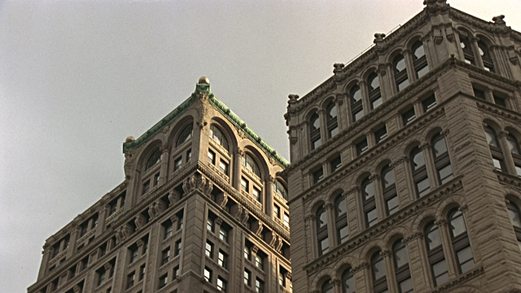
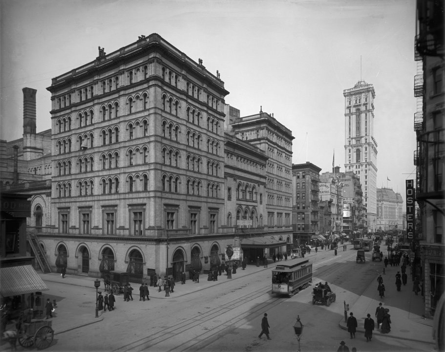
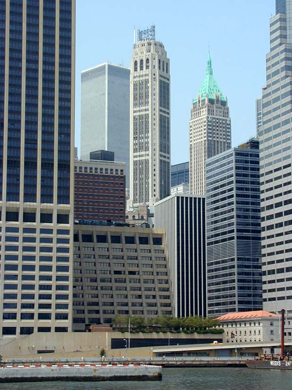

# Project 4: Shape Grammar

For this assignment you'll be building directly off of Project 3. To make things easier to keep track of, please fork and clone this repository [https://github.com/CIS700-Procedural-Graphics/Project4-Shape-Grammar](https://github.com/CIS700-Procedural-Graphics/Project4-Shape-Grammar) and copy your Project 3 code to start.

**Goal:** to model an urban environment using a shape grammars. 

## Inspiration
I wanted to generate a city remeniscient of New York City, so I first analyzed the general characteristics of its buildings. I broke down the city to have two general types of building structures: 19th/20th century apartments, and modern skyscrapers.

For 19th/20th century apartments, I used two reference images.

The first image is of the New York Times building constructed in 1889 and is still standing today. What I took from this image is that there are 1-story as well as 2-story windows. In addition, arched windows seem like a common decor. The other 19th/20th century apartment image is black and white, so the brown-yellow coloring of this building also tells me more about the material used to construct it.

The second image is of the Old Metropolitan Opera House built in 1883 near Times Square. There generally seems to have an extruded "ledge" near the top of every window. In addition, the roof is relatively flat and has multiple "ledge" extrusions.

For modern skyscrapers, I used a reference image of the Wall Street skyline.

The modern skyscrapers are a lot simpler compared to the 19th/20th century apartments. Either the windows on each floor are horizontally aligned or vertically aligned. In addition, the color of the buildings have a blue tint because the windows are generally reflecting the colors of the sky.

## Design
I decided that each building will be made up of a bunch of sculpted unit cubes. That way, I can easily move them around to make differently shaped buildings. I have a pet peeve of having an exact reason for every decision I make in designing things, so I based all my cuts and extrusions on the Golden Ratio. Modeling every piece of the building using the Golden Ratio took a weekend to do.

Unfortunately, I ended up not using the arched windows beacuse they had too many polygons and slowed down the program immensely.

## Shape Node
Each shape node contains the following variables: 
- String to keep track of the associating symbol to this shape
- 4x4 Matrix to keep track of position and rotation (similar to a scene graph)
- Vector3 to keep track of the building scale 
- Boolean whether the shape is terminal or not
- String to keep track of which geometry type to apply these other parameters to.

## Creating the City
The grid system New York City uses seemed a little boring, so I decided to spice it up a bit. I used stratified sampling (yay advanced computer graphics!) to generate a Voronoi Diagram. The edges on the Voronoi Diagram represents the streets of the city. The reason for the stratified sampling is so that not many streets will clash with one another in a single area.

Using a gain function (yay toolbox functions!), I modeled the popluation density of the city so that the center of the city has the highest population, and decreases as you move farther away from the center. The higher the population density, the taller the buildings. Since 19th/20th century apartments are generally no taller than 30 stories, and skyscrapers are usually taller than 30 stories, I made it so that buildings less than 30 stories are apartments, and buildings taller than 30 stories are skyscrapers.

I colored the buildings with a gain function so that the farther away a building is from the center, the darker the color. In addition, I applied IQ's color gradient implementation (yay color mapping!) to the apartment buildings. The taller the apartment building, the more of the brownish-yellow gradient you can see. I did not do this with the skyscrapers because the floors of the skyscrapers is generated by stretching out one window mesh. 

## Grammar Design

- Design at least five shape grammar rules for producing procedural buildings. Your buildings should vary in geometry and decorative features (beyond just differently-scaled cubes!). At least some of your rules should create child geometry that is in some way dependent on its parent’s state. (20 points)
    - Eg. A building may be subdivided along the x, y, or z axis into two smaller buildings
    - Some of your rules must be designed to use some property about its location. (10 points)
    - Your grammar should have some element of variation so your buildings are non-deterministic.  Eg. your buildings sometimes subdivide along the x axis, and sometimes the y. (10 points)   
- Write a renderer that will interpret the results of your shape grammar parser and adds the appropriate geometry to your scene for each symbol in your set. (10 points)

## Optimizations
- Did not save geometry in each Shape Node. Instead, just used the geom_type to add the geometry to the scene.
- Removed unneeded "new" objects because web browser garbage collection is not that great.
- Deleted unseen faces of each building geometry model to avoid unncessary lambertian shading.

