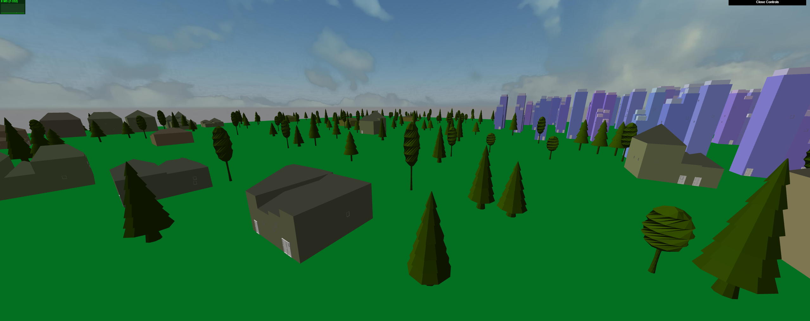

# Shape Grammars

# Grammars
Much of the grammar is baked into the code. There are in total 8 distinct rules that buildings go by.
 - Explicit
   - G -> (O1, O2, O3)* The ground spawns trees of three different forms
   - B -> bD A giant block is subdivided and a Door is added
   - b -> bOW* subdivided blocks are further subdivided + roof + windows
   - D is a symbolic terminal node
 - Implicit (Could be refactored into explicit rules, but the effort taken isn't worth it
   - O -> (r0|r1|r2|r3) Roofs can take on multiple forms and will subdivide with buildings
   - b -> (b s1|b s2) Subdivided blocks are sliced along xz or yz planes
   - b s1, b s2 -> (b 1r|b 2r) Subdivided blocks are rotated
   - r0 -> b Roofs on tall buildings will actually convert back into a box cap. There is an iteration cap so we don't have to worry about non-terminal cyclic grammars.

See [Buildings](#Buildings) for more information on how Building grammars behave

# The Grid
There is an in-memory grid structure that directs and oversees all object construction. This is to keep track of what is where, demarcate zones, spawning rules.

# Zoning
A **Voronoi diagram** is created such that 5 points arbitrarily selected as "seed" locations will demarcate zones on our plane. Zones range from 1 to 5 (1 being lowest pop. density, 5 being highest pop. density) and a zone of 3 indicates forestry.

# Buildings
Urban Houses (Zone 1): These houses are wider and will arbitrarily rotate its subdivisions to extend further outward
Suburban houses (Zone 2): These houses are unit sized and follow default subdivision rules.
High-density Residence (Zone 4): These are apartment-like houses that have their height extended and follow default subdivision rules. These will appear pink, have more windows, and a door.
City Financial District (Zone 5): These are similar to Zone 4 except taller and appear more indigo and all features are more brought out.

Windows are placed based on the building height. The larger the zone number, the more windows (because the buildings get bigger). They are placed randomly with no constraints. Doors are only placed on the primary building body (the body that eventually will be subdivided) and thus buildings will each have a single door.

# Tree Placement
Tree placement is an interesting problem. Aside from modulating spawn frequency based on zoning, we also ensure that trees don't spawn near houses. The forward naïve solution seems to work better. I also tried doing a convex optimization where I constructed a cost function that penalized tree-object intersections. Then I used Monte-Carlo sampling to select a configuration that maximized on that cost function. It was too slow.

# Road (In progress)
There are 3 approaches which I am perfecting (the code is there but it's not ready...).

Another convex optimization: Again we construct a cost function and feel out the topology with some Monte-Carlo method and maybe with naïve greedy construction. The cost function here would probably mimic properties of real road systems: minimizing winding paths, minimizing travel distance between any two buildings, minimizing the number of roads used, promoting axis alignment (crutch feature that I hypothesize will help with the first two features), minimizing nearby intersections, etc.

Grid Road: Here we use the grid to help us construct roads. We establish arbitrary points near a building to denote an entry point. We have now reduced the problem to path-finding on a grid-structure with obstacles (the buildings). Since we want to promote more structure in a road system, we use a geometric mean heuristic. I thought about using a l2 norm or even a l1 norm but I hypothesize that they're not strong enough as heuristics. You can visualize this by imagining an astroid for a geometric mean heuristic–this is essentially how it weights its choices.

Generative Road Construction: Here we have the same approach to Grid Road except it is without a grid. It's free-form and starts with points near buildings to denote entry points. We then connect those points with straight lines and then add control points to create curves that move the roads so they do not intersect with houses.

It would also make sense to build the road system first, and then insert houses in. We can use the first two algorithms above to do so, and I believe the first will outperform the second. But I did not have time to explore this option.
