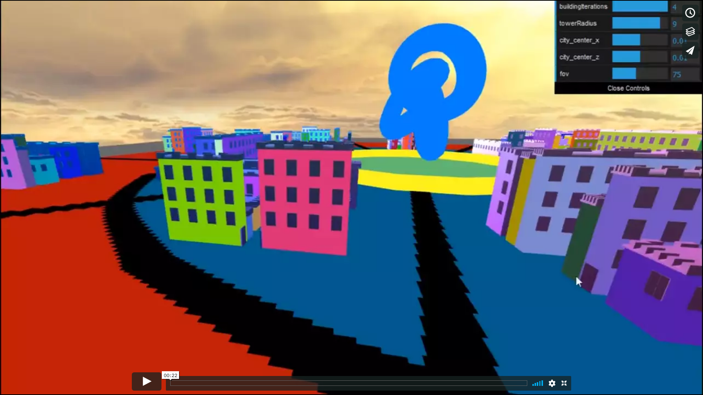
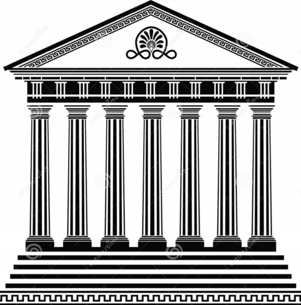

# Dynamic Procedural City

## Overview

A procedural city built using shape grammar; The city is dynamic and changes with every build.

## Introduction to Shape Grammar

Shape grammars in computation are a specific class of production systems that generate geometric shapes. They are very similar to L-Systems but the grammar production process and rendering instructions are more intertwined.
- Symbols have numeric attributes, eg. position, scale
- Successors are computed, based on the numeric attributes of their predecessor, instead of just being predetermined
- Since transformation information is usually stored, symbol ordering is not necessarily important

#### Basic Layout of shape grammar systems:

Symbol = {terminal, non-terminal}

Shape = {symbol, geometry, numeric attributes}

Rule = {predecessor, successor = f(predecessor), probability}

1. Begin with some configuration of shapes (like an l-system axiom)
2. Select an shape S from set.
3. Choose a production rule with S as predecessor, compute successor(s) S_new, and add it to the set.
4. Remove S from the set.
5. Repeat until all shapes in the set are terminal.

#### Example

Describing a simple building with some basic rules.
- temple -> Subdiv(“Y”, …, … } { podium | columns | roof }
- column -> Subdiv(“Y”, …){ base | shaft | capital }
- columns -> Repeat(“X”, …){ column }
- base -> (corinthian_base)
- shaft -> (corinthian_shaft)
- capital -> (corinthian_capital)
- podium -> (podium)
- roof -> (roof)

## Project details

The project goes about creating a city, which is created anew every time an item of the gui is updated.
Every building is modeled procedurally based on shape grammar rules and the city layout is similarly randomized.
Various GUI controls were added to give the project more life.

### GUI controls:
- Change the position that the city will spawn around.
- Change the number of iterations over the shape grammar rule applied to buildings.
- Change the density of the city.
- Change the field of view of the camera.

### Talking points for the Algorithm
- Create multiple layers of circles of increasing size centered at the same point.
- Have major roads along alternate segments joining these circles. Permanent roads.
- Have minor roads be created randomly that connect various arcs of circles.
- Place buildings inside the circles in between roads.

### Shape Grammar rules
- Subdivide buildings randomly about x or z axis
- Scale every building randomly
- Place windows on buildings depending upon the length and width of the building. And The windows are all above the ground floor.
- Add a door randomly on one of the faces of the building and randomly jitter its position along that wall.
- Add roof tops to buildings, depending on the shape and size of the buildings.
- Give every building a random color.
- All features added after the main cube building structure are shaded based on position.

## References:

- https://cis700-procedural-graphics.github.io/files/shape_grammar_2_7_17.pdf