
# Project 4: Shape Grammar

I built a suburban neighborhood. The final product can be found at https://tabathah.github.io/Project4-Shape-Grammar.
The following as an overview of how I completed this projet. Some pictures of the final product from above and from a side view are here:

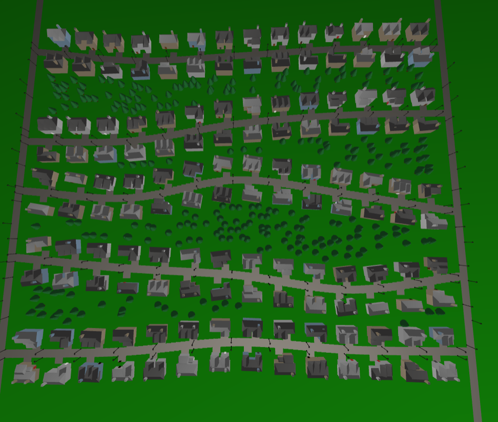 

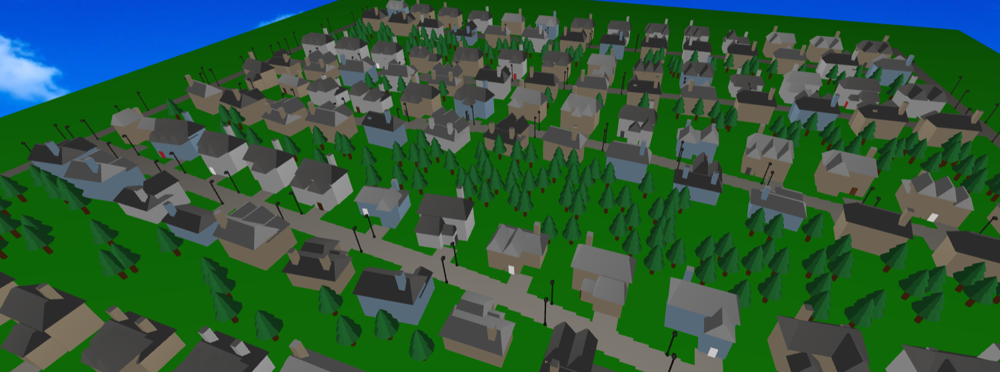

**Creating the Homes**

Each of the homes in this neighborhood was procedurally generated using a shape grammar. I started with one initial shape and that shape was subdivided or rotated based on random probability in order to get a fairly realistic looking suburban home. 

The shapes were represented by a Shape class that had the following information: a character symbol representing what time of shape it was so that following transformations and rendering of the shape would be done properly, the position, rotation, and scale of the shape, used to create the mesh that appears on screen, the material of the shape so that through each of the iterations of the shapes changing they would all remain the same colors, vectors representing the local x and z axes of the shape so that when new positions were calculated, they would be moved in relation to the shapes current orientation, and finally a boolean representing whether this shape should have a door.

My initial shape was a simple house shape with a rectangular box and triangular prism on top, which I created in Maya and imported as an OBJ file. The initial OBJ is depicted below:

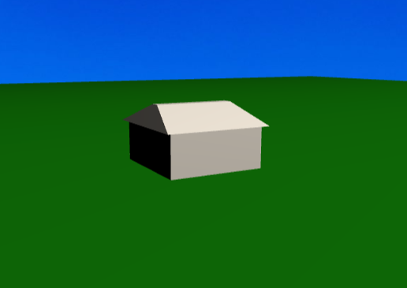

I wrote shaders for the texturing of the houses. One of two roof colors and one of three wall colors was randomly chosen and sent into the shader. In the fragment shader, the normal at that point was checked for a non-zero y-component. If the y was non-zero, it had to be a part of the roof so it was colored with the input roof color, otherwise it was part of a wall so it was colored with the input wall color. Here is the result:

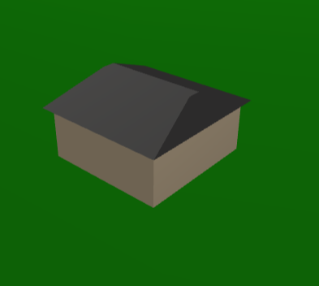

At the first iteration of executing the grammar, the house always subdivides along its z axis in half. Then one of three configurations can happen with some probability. In the first possible configuration, the front half of house resulting from the subdivision is scaled down by half in the z direction and moved to either the left or right side of the house. In the second configuration, the front half from the subdivision is discarded and two house shapes of depth equal to half the back half from the subdivision's width are rotated 90 degrees and placed in the front of the house. In the third and final configuration, a similar operation is done as the second configuration, except three house shapes of depth equal to a third of the back half's width are placced in the front of the house. Here are pictures of the first, second, and third configurations, respectively:

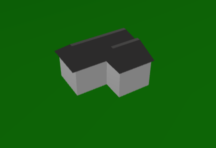

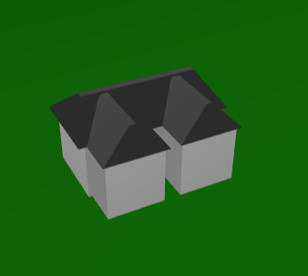

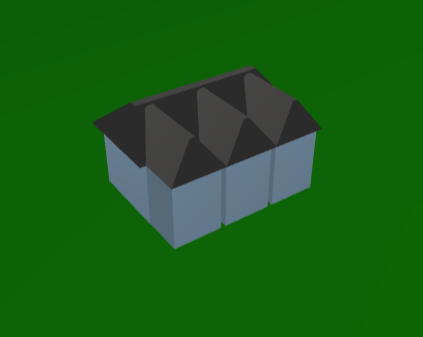 

At the second iteration of executing the grammar, the shapes are slightly modified and detail additions are made. In the case of the first configuration, another scaled down shape is added to the inner side of the front shape, as depicted below:

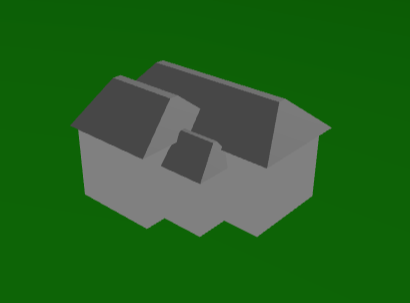 

In the case of the second and third conifgurations, the rotated shapes in the front are modified in the following way. Either the shape is deleted entirely, unchanged, its height is scaled by 1.25, or its height is scaled by 1.5. Here is a picture of a house with fronts of all diferrent heights.

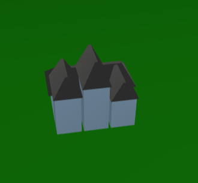 

Finally, at the second iteration, I modified the back half of the houses, which was in all three configurations. Firstly, with some probability I had the height scale up by 1.5. This is the first picture below. Secondly, I added a chimney to either the right or left side of the back of the house. I shaded this chimney with the same shader on the house. A chminey is shown in the second picture below:

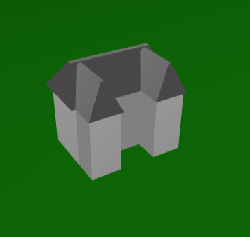 

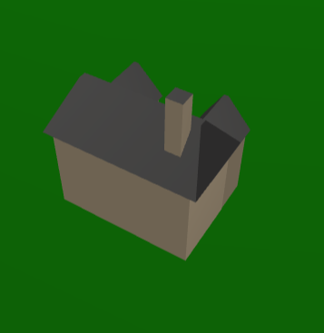

For both the height modification of the back half and the rotated fron house shapes, I increased the probability of the height scaling up in relation to the z coordinate of the shapes position. This way, on one side of the nieghborhood the houses tend to be taller than on the other side, formins some sort of class division if you will. 

One last extra detail was the doors. If the house went into the first configuration at the first iteration, the door ended up on the inner house shape that gets added in the second iteration. If the house went into one of the other two configurations, one of the two or three front rotated shapes was randomly chosen to have a door on it. If that shape was not detroyed in the second iteration, the door was placed in the front of it, otherwise it was placed on the back half of the house. Two examples of doors are shown below:

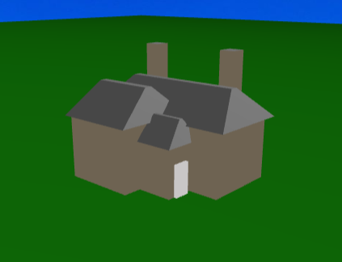 

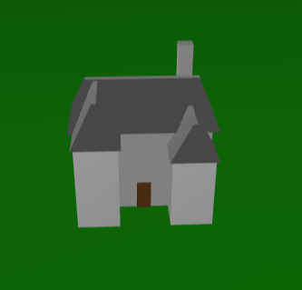 

**Forming the Neighborhood Layout**

I first started with two straight main streets on either side of my neighborhood, shaded grey:

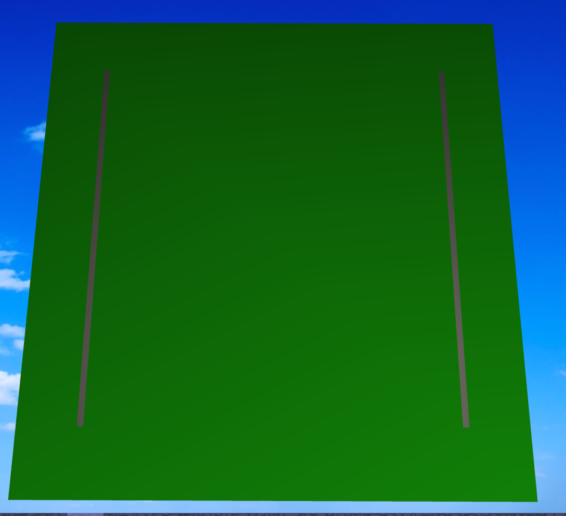 

I then created the roads that my houses would be situated on. I created 5 three.js CatmullRom curves by making points out of equally spaced x values and z values that had some random offset between -6 and 6. I then added road squares to points on the curve to display the curves.

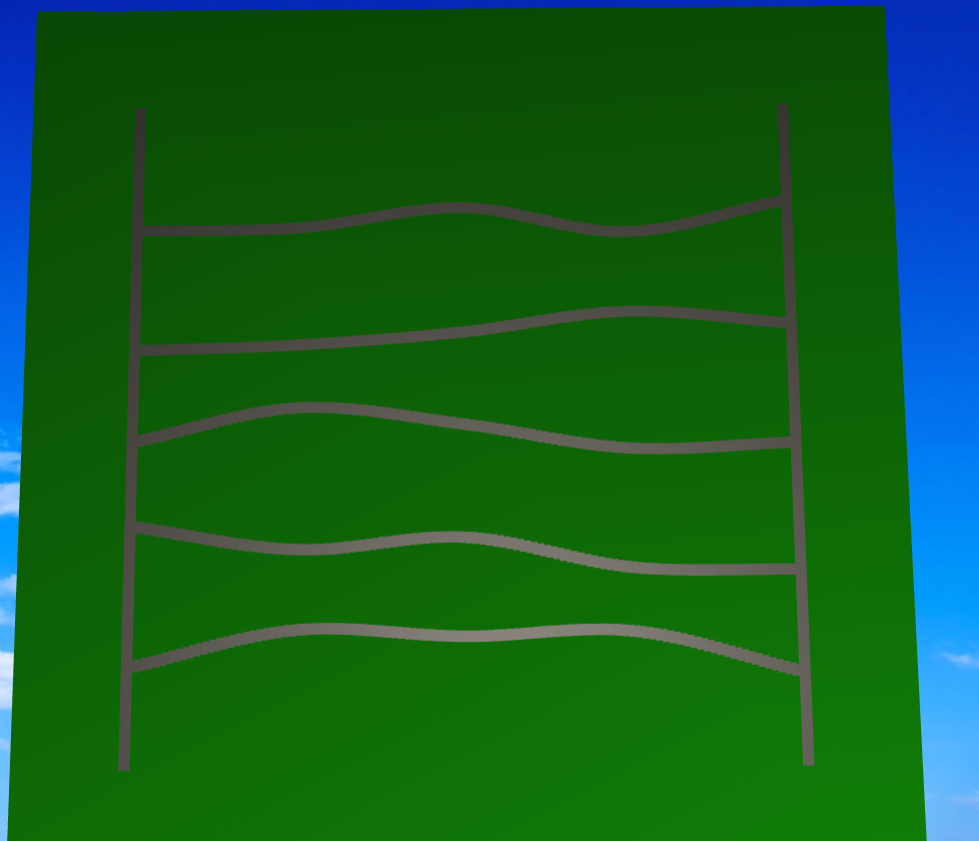 

Now it was time to add houses onto the roads. At evenly spaced points on the curve I put homes and rotated them so they would be parallel to the tangent of the curve at that point. I also offset them a bit away from the curve in the z direction so they would be next to the road rather than on it. 

Here is a picture of houses on one side of the road:

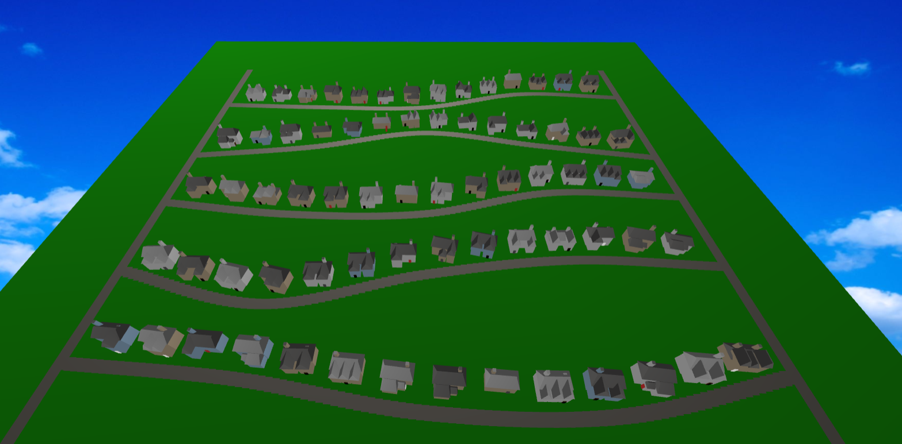 

And here is a picture of houses on both sides (the houses were rotated so that they would be facing the road):

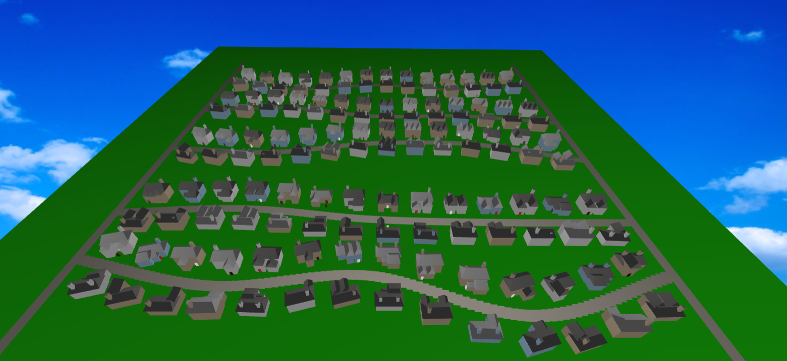 

**Adding Details**

The first detail I added was driveways. I simply added a road square in the same positions where houses were added, offset from the road slightly less than the houses were to create a semblance of a driveway.

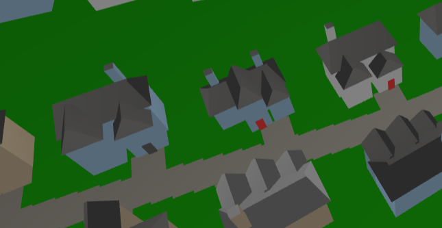 

Next I decided to make trees. Again I created my own model in Maya and imported it as an OBJ. I shaded them the same way I shaded houses, as again any normals with non-zero y-components corresponded to leaves and the others were part of the trunk. I wanted the trees to populate the empty space between the roads my houses were on. To do this, I found the difference between the z coordinates of points on two consecutive roads and added trees in the space where they wouldnt overlap the houses or roads. At every point where a tree could be placed I added it with a 50% chance. I also offset them in the x and z randomly to give the semblance of realistic tree populating. The result was the following:

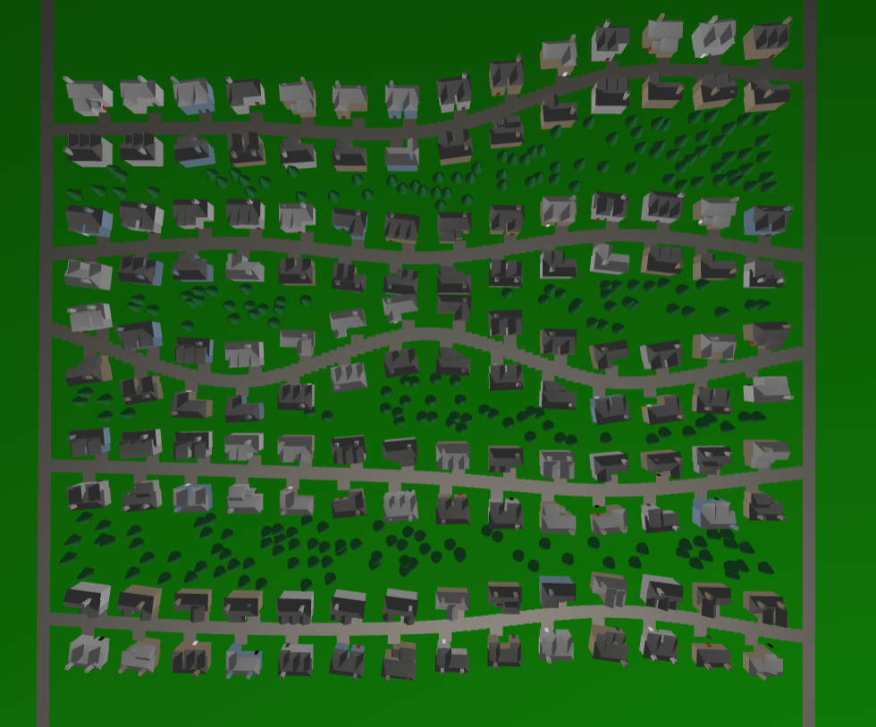

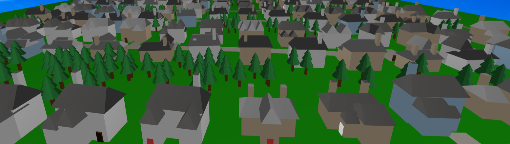 
 
The last detail I added was lamp posts. I created my own, very crude geometry in Maya. I added them on either side of both the main side roads and the roads the houses resided on. A closeup is depicted here:

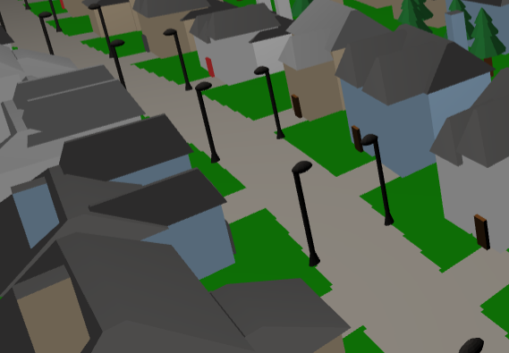 

