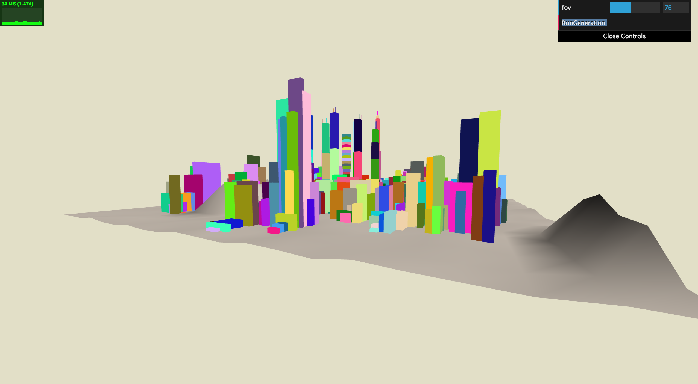
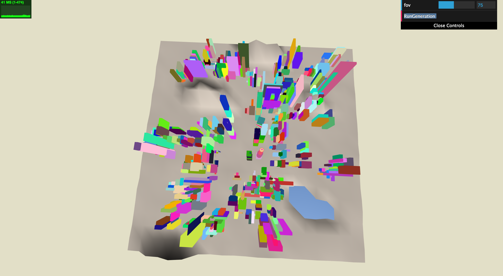
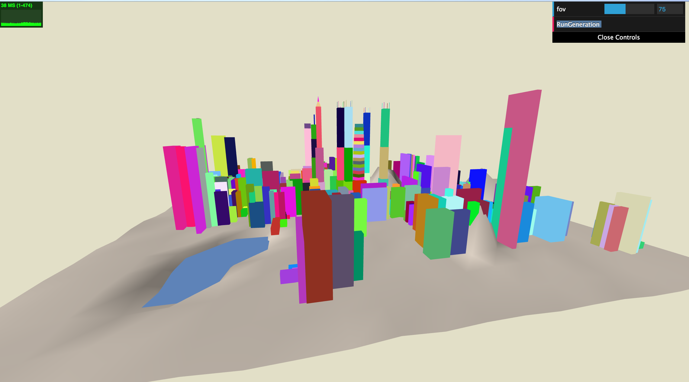
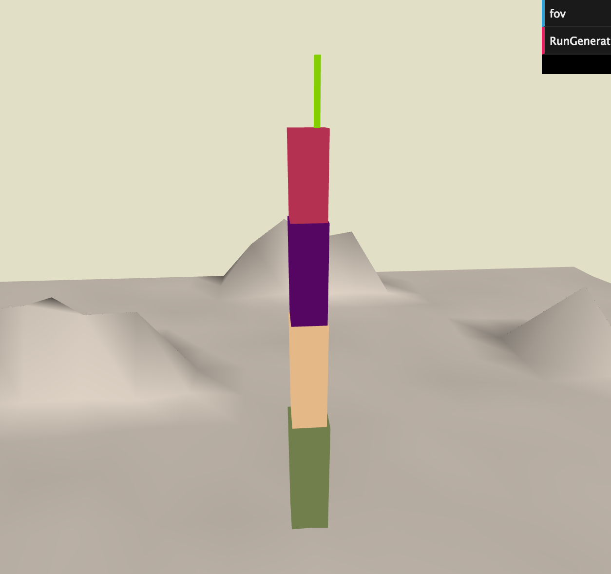
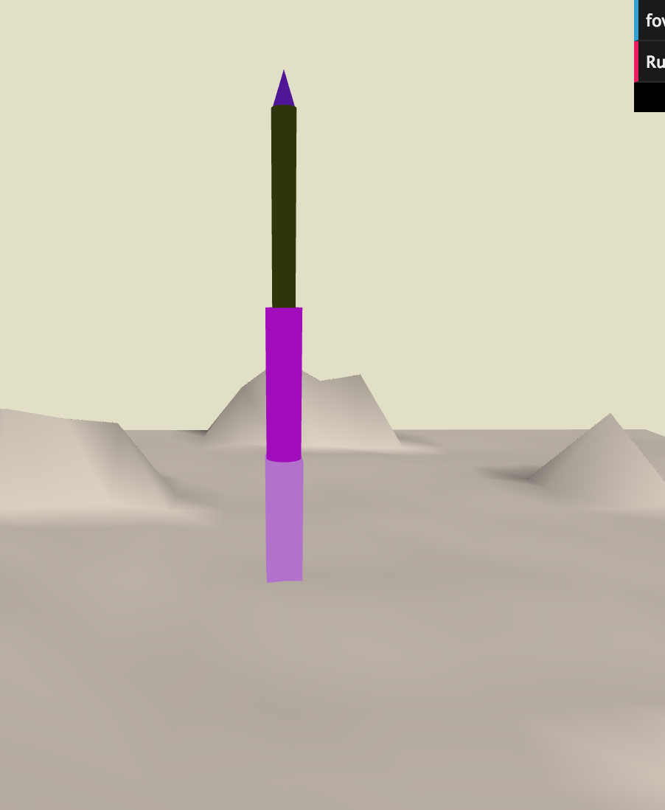
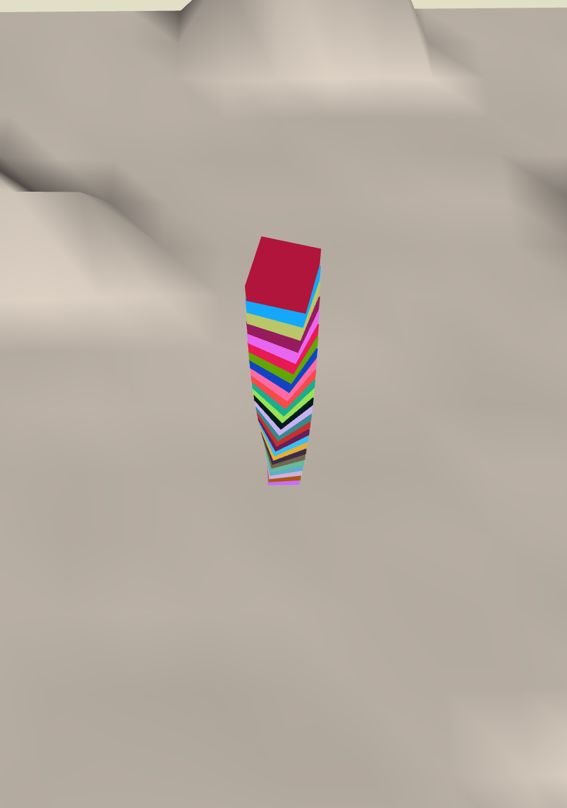
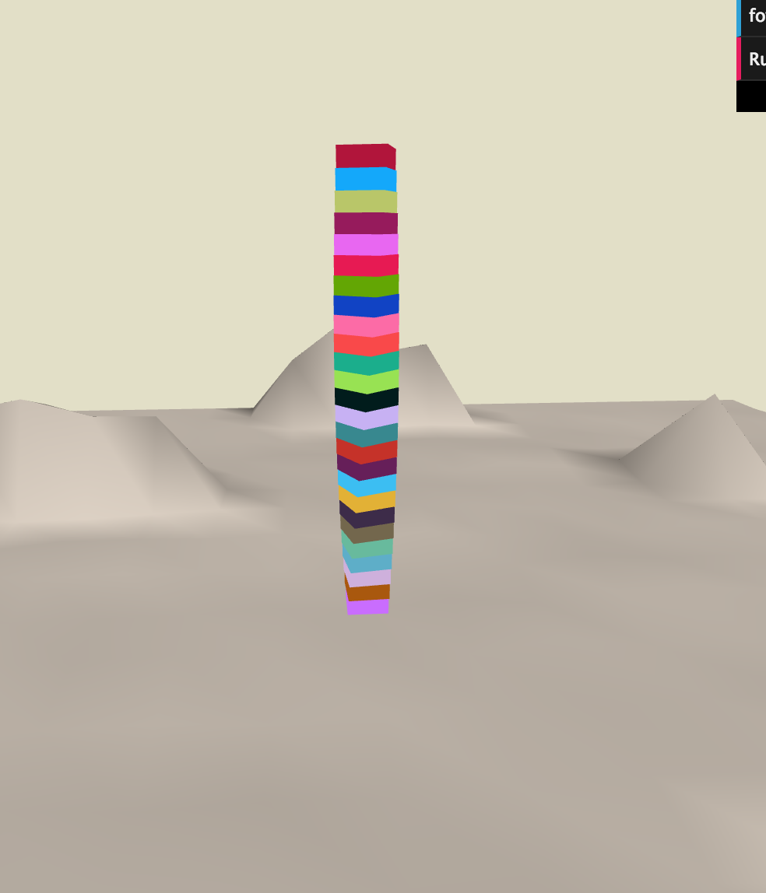

# Project 4: Shape Grammar

Name: Rudraksha Shah, PennID: rdimple

**Goal:** to model an urban environment using a shape grammar.

## Grammar design

The shape grammar works thus:

- The scene starts with a base plane being created which gets applied with a random noise between [0,1) over the entire plane to provide a rough terrain like surface.
- Hills and a lake is generated on the terrain which completes the creation of the terrain.
- 100 cubes are added to the scene and are randomly distributed throughout the terrain. A bounding box is created around the hills and lake such that no cube will be generated on the lake or on the hills.
- All the cubes, base plane and cylinder geometry (that comes in later) is applied with a random texture material.
- RunGeneration loops through all the cubes and by some random chance choses to either subdivide the cube along the X-axis or Z-axis into two new cubes. Scaling of the original cube along the Y-axis is also possible.
- The cubes that are closer to the centre of the terrain i.e. the downtown region have a probability of becoming a tower instance, in which case it becomes one of the following towers:
    - A step tower with two antennas.
    - A step tower with 4 antennas.
    - A step tower with cylinders as its higher floors.
    - A spiral tower.
- Each RunGeneration loops through the existing buildings in the scene and randomly subdivides them.
- After a certain number of generations if the buildings have reached their maximum possible subdivision limit then no further manipulation is performed.
- All buildings are randomly seeded and subdivided to avoid any grid patterns.

**Issues:**

- Working on Textures:
    - The texture loading has a bug and I know how to rectify it but the colored buildings look better than the textured buildings so I have left them as is.

## Screen shots

Colorful City Scape with Hills and Terrain:

Top View with Lake and building distribution:

Towers in the Downtown:

Step Tower:

Cylinder Tower:

Spiral Tower:
 
