png# Procedural City
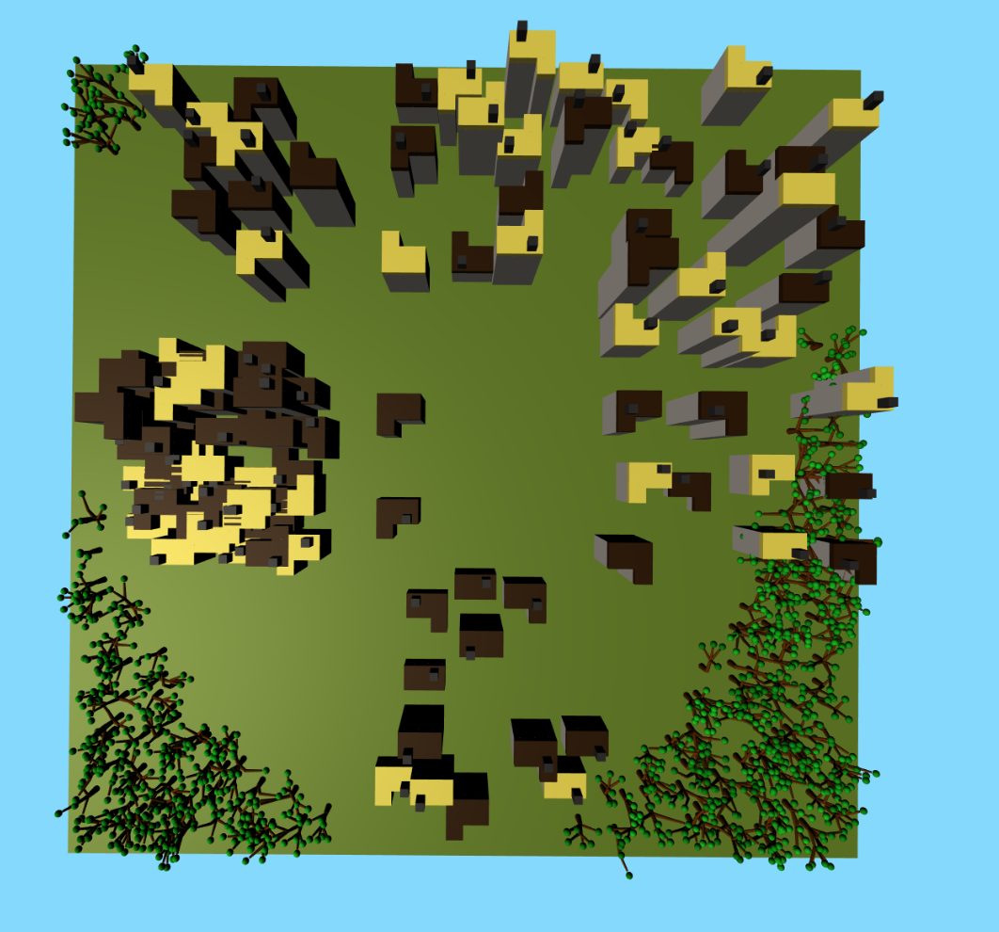

## Objective
Use L-Systems to create a procedurally generated city.

## Inspiration
My inspiration for this project was Asterix's village, which is a vision I kept for most part of my project until I realizzed technical incapabilities like slow obj loading that made me make a more simplistic version of the village that meets the requirements.
 
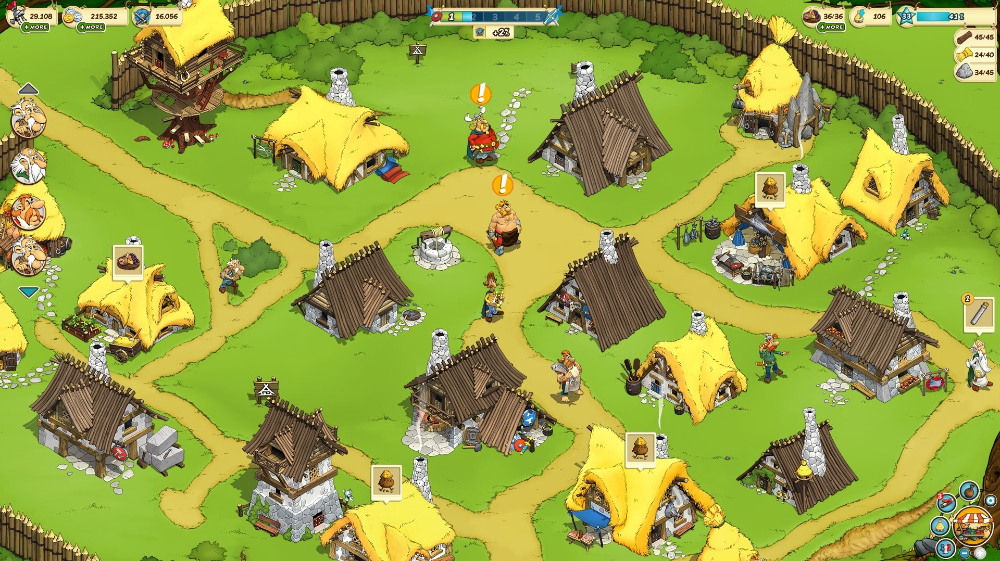

## Process
I started by designing a grammar for my houses. I added variations like levels, color of the roof, chimney and subdivision.  
This is what different instances of the same iteration look like -
 
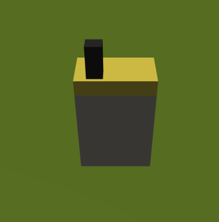
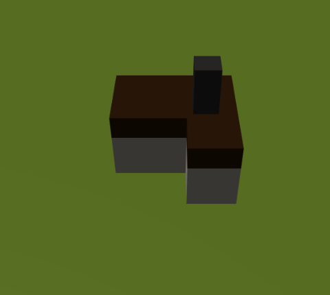

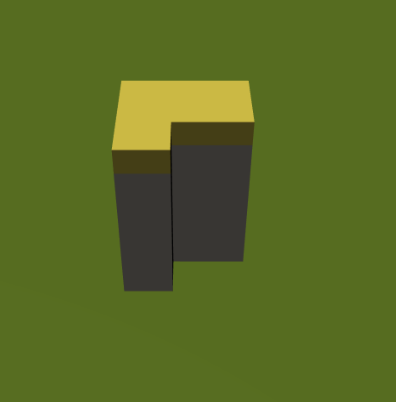
 
This is what different iterations look like -  
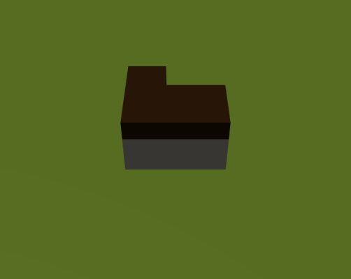
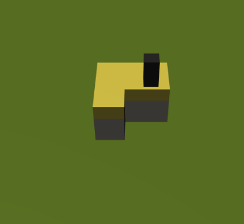

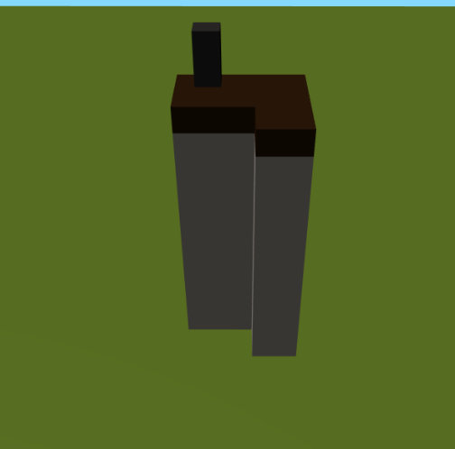
 
Once I was done with this, I thought about how I want to lay out my city. After several trials, I decided to use a pcurve to define my city shape and surround it with forests. I wanted this to change everytime too, so I now I change the bias of the curves everytime. 
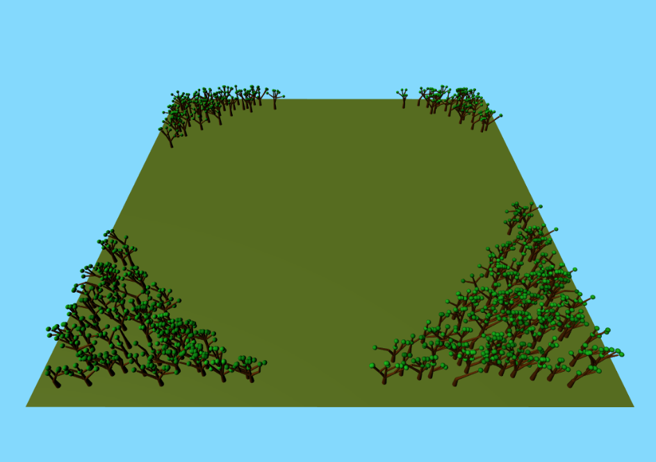
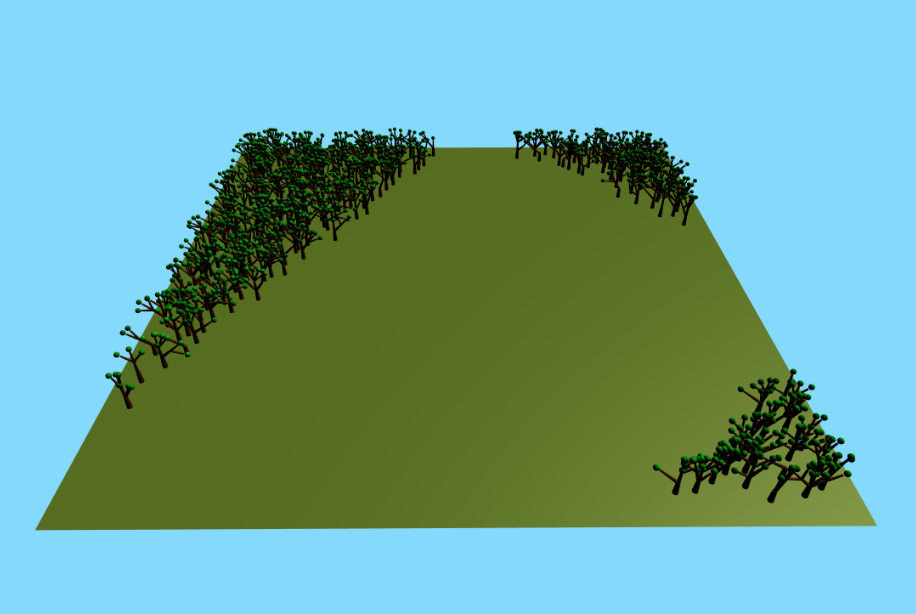
 
Then, I wrote a function that takes in the radius and population to make a "cluster" of houses. 
This is how the cluster of houses looks like for different populations. 
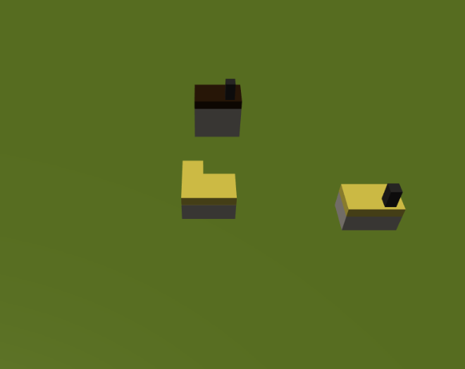
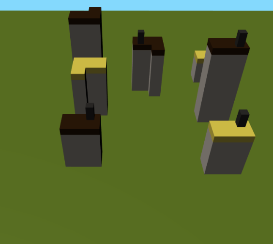
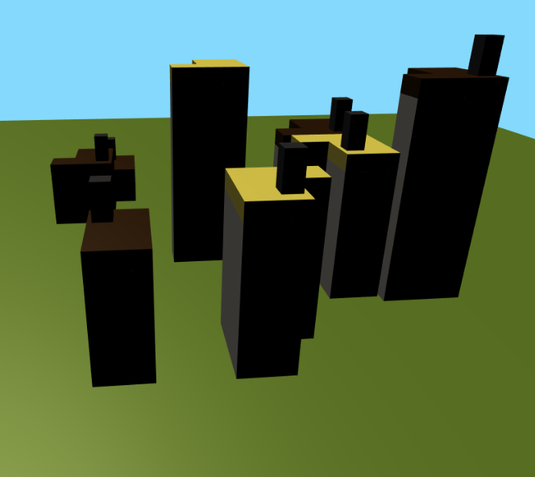
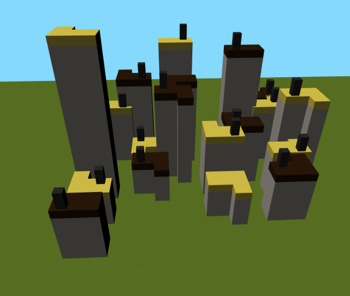
 
This is how the cluster of houses looks like for different radii. 
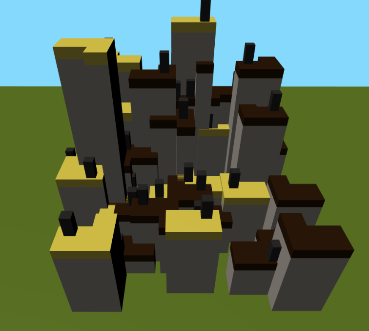
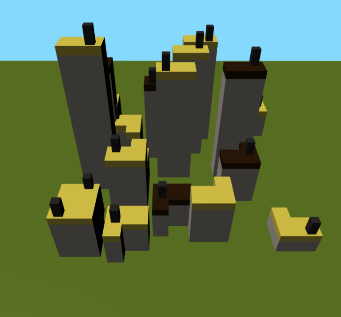
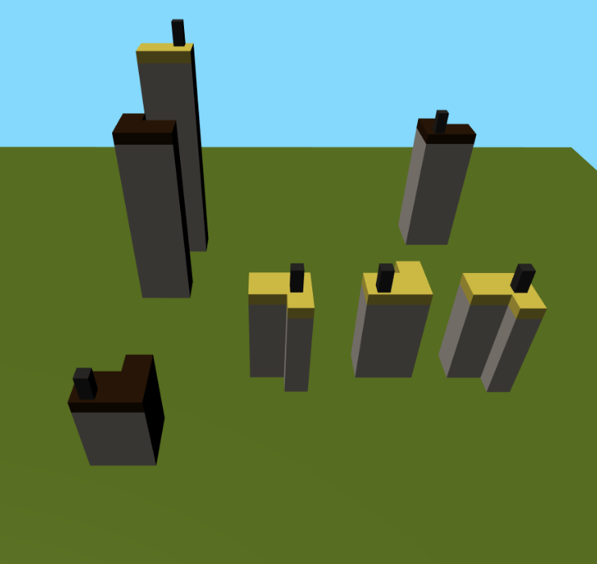
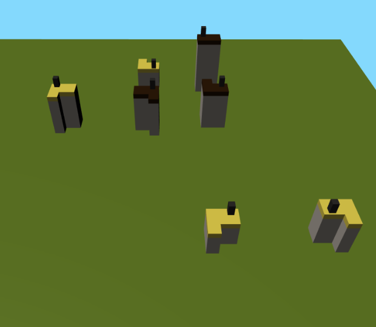
 
Finally, I integrated my cluster function into a nested for loop to place clusters in some parts of the land. This is also randomized, but stays within the city bounds.
 
Here are some instances of the city generation. 
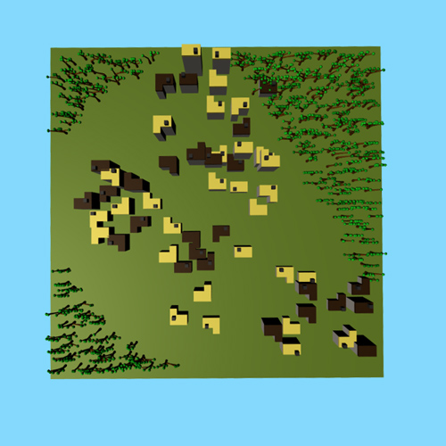
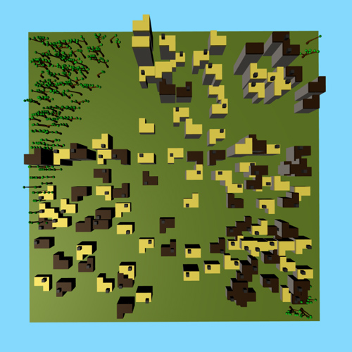
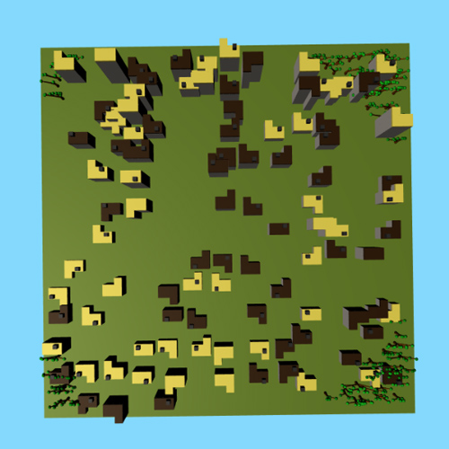
 
And here are some city skyline photos. 
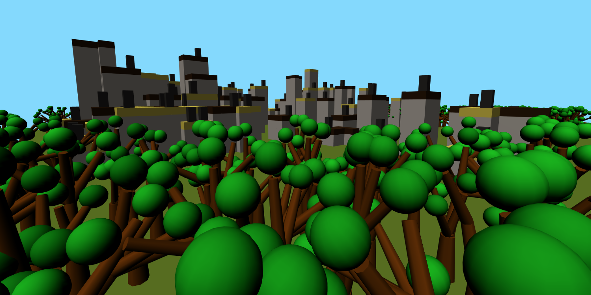
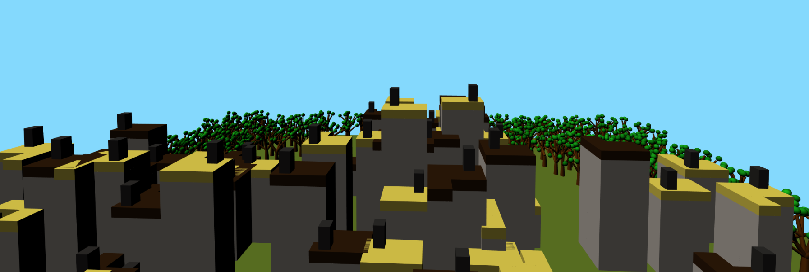
