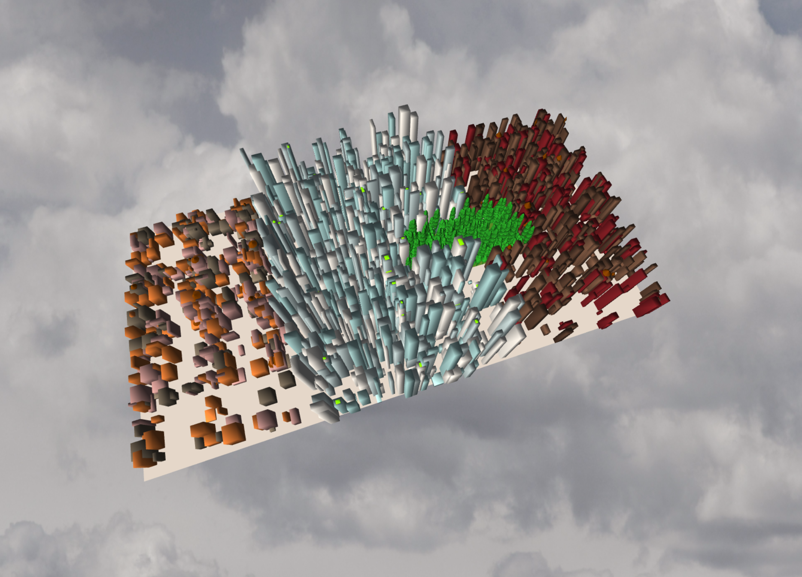
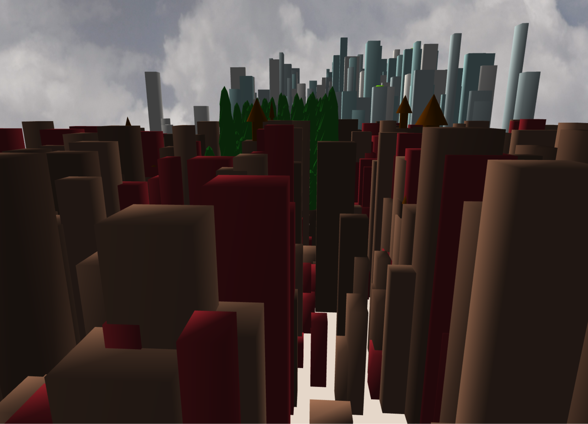
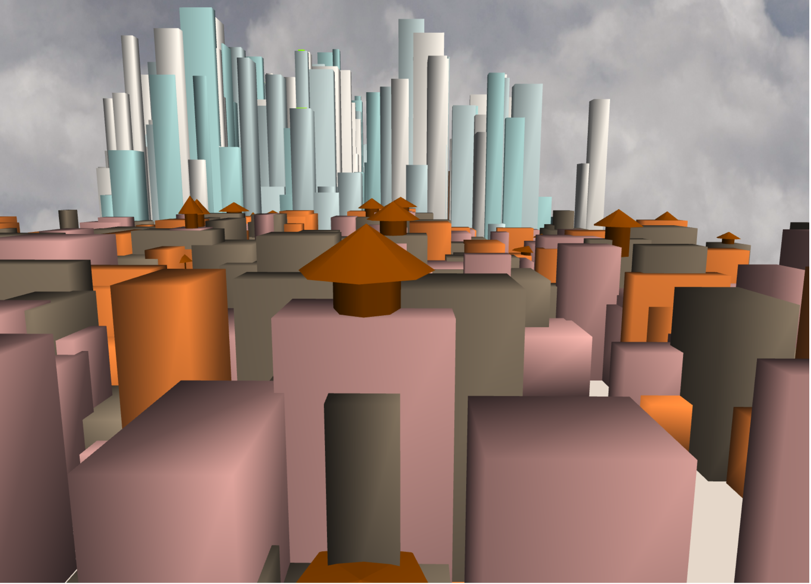
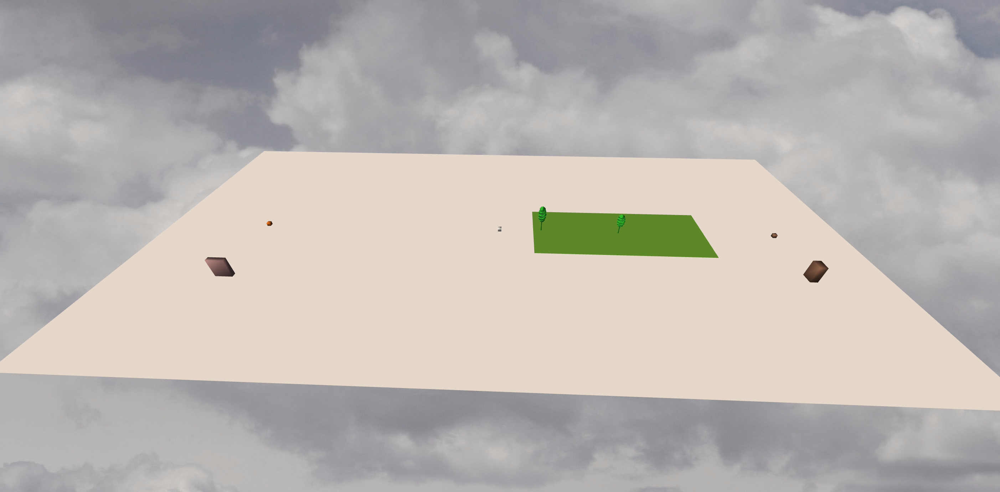
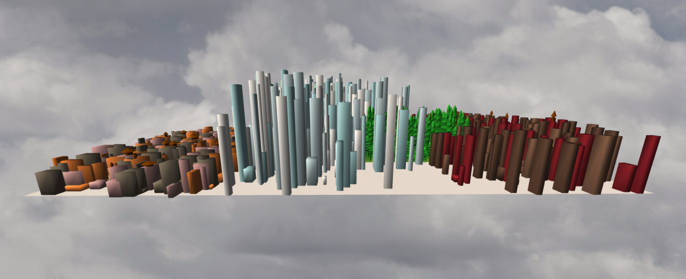
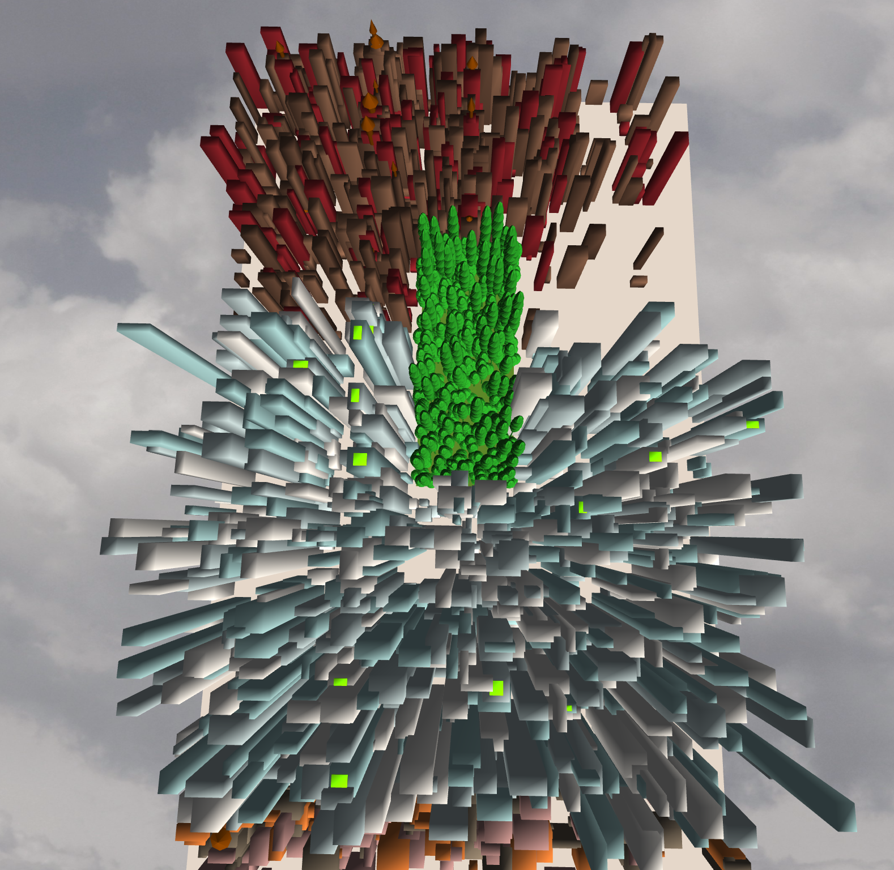

# Project 4: Shape Grammar

[Demo](http://josephgao.me/Project4-Shape-Grammar/)

* Author: Joseph Gao
* PennKey: gaoj

**Goal:** Model an urban environment using a shape grammar. 

**Please be nice this took a looooooong time :'(**



## Setup
- Please run npm install, as I changed the package.json so I could load in .OBJs. 
- Have your volume on! :)

## File Structure
- `main.js`: The driver of the program. Instantiates necessary components and is largely unchanged from what I was given to start with.
- `shapegrammar.js`: The Grammar design portion of the assignment. Here I define a basic `Rule` class as well as **7** shape grammars for producing procedural buildings. The `Rule` class has two fields: a probability and a successor. The probability is to facilitate randomized, non-deterministic cities, while the successor simply defines the type of behavior that should follow when a structure is of some type.
- `citybuilder.js`: The ShapeGrammar class serves as only a glorified dictionary that is used by citybuilder to actually generate my city. The crux of the heavy lifting in terms of calculations, subdivisions, position adjustments, randomization implementation, all lie within this file. 
- `renderengine.js`: This is the final part of my 'pipeline', if you will, that is able to interpret the output of citybuilder and actually generate the city. Nothing too major going on here. I also initialize parts of the scene in this file, such as the concrete ground, the skybox, and the grass for Central Park.
- `lsystem.js`: Not used.
- `turtle.js`: Not used.


## Grammar Design

I will explain the details and considerations that went into developing my NYC Shape Grammar.

### Non-deterministic, random variation
- I have designed 7 shape grammar rules that allow me to accurately (well, to the best of my ability) model Manhattan.
- The first three rules simple define the four primary parts of Manhattan: Uptown, Midtown, Downtown, and Central Park. The rules have the probabilities tweaked to my liking, so the buildings look evenly distributed. **Note that sometimes, probability curses me, and the city layout looks awful. Just refresh the page! :)** The first three symbols have the same successors, `N, S, E, W`, which tells the citybuilder to split along the positive/negative x/z axis. The last symbol (`P`) has three unique successors, `1, 2, 3`, which tells the citybuilder to scale a tree in central park by a certain height, depending on the successor. 
	- This satisfies the requirment of variation and non-deterministic building placement.
```javascript
 this.grammar['U'] = [
  new Rule(0.3, 'N'),
  new Rule(0.3, 'S'),
  new Rule(0.2, 'E'),
  new Rule(0.2, 'W')
]
this.grammar['M'] = [
  new Rule(0.25, 'N'),
  new Rule(0.25, 'S'),
  new Rule(0.25, 'E'),
  new Rule(0.25, 'W')
	]
this.grammar['D'] = [
  new Rule(0.3, 'N'),
  new Rule(0.3, 'S'),
  new Rule(0.2, 'E'),
  new Rule(0.2, 'W')
]
this.grammar['P'] = [
  new Rule(0.33, '1'),
  new Rule(0.33, '2'),
  new Rule(0.33, '3')
]
```

#### The view from the Upper East Side


### Parent-child depedencies, and more than just cubes!
- As mentioned in the comments in my code, these next three symbols in my grammar are PARENT dependent. What this means is they are only constructed after certain conditions have been met by their parent geometry (e.g. subdivided twice, etc.). Once these said conditions are met, I uses these symbols to either spawn fancy little rooftop gardens on top of skyscrapers (because you know, those rich midtown denizens can't get enough of the happy-hour rooftop chats), as well as generate watertowers on top of the SOHO lofts and Uptown Brownstones (They need to get their water somehow, but TBH I'm not sure how midtown gets their water... someone enlighten me please). The rooftop gardens and watertowers are scaled accordingly to their parent geometry as well, so it doesn't look awkward.
	- This satisfies the requirement of not just differently scaled cubes, and parent-child geometry relationships. 
```javascript
this.grammar['S'] = [
  new Rule(0.50, 'G'),
  new Rule(0.50, 'F')
]
// this one makes water towers on top of a loft (SOHO)
this.grammar['L'] = [
  new Rule(0.8, 'T'),
  new Rule(0.2, 'F')
]
// this one makes water towers on top of a brownstone (UPTOWN)
this.grammar['B'] = [
  new Rule(0.25, 'T'),
  new Rule(0.75, 'F')
]
```

#### Spacious Loft in SOHO for $10000/month


### RenderEngine
- The `renderengine.js` file is the rendered we were required to make to interpret our grammar.

## City Generation

Now onto how I made the city itself.

### Initialization
- I threw down a flat 10x20 plane, and colored it the color of NYC pavement.
- Then I tossed in a green 2x5 plane, and put it roughly where central park would be.
- Finally, I threw in 4 base shapes, one each for Downtown, Midtown, Uptown, and Central Park.

#### Initial scene after one iteration


### Population Density
- I tried to correctly model the population density of NYC as closely as possible. Obviously, all of Manhattan is packed. However, it's known knowledge that Midtown has the highest, more tourist friendly buildings, and just south of Midtown is Chinatown/SOHO, where the buildings are noticeable shorter. Uptown, while having no shortage of tall buildings, is filled with more residential brownstones/redstones rather than the fancy skyscrapers of midtown or the chill lofts of SOHO. Thus, while the population density of Manhattan may just be red all over, I made the assumption that for Manhattan, more people live in Midtown than Uptown, and more people live in Uptown than Soho (including non-permanent residents, such as tourists, etc.). In addition, I sound some color packs that, in my opinion, correctly captures the 'atmosphere' and 'environment' color Uptown, Midtown, and Downtown, respectively (Central Park is just green trees of differing sizes). 

#### Manhattan


### Central Park
- While I alreaady demarcated various zones throughout my city, I really wanted to get Central Park into the model. While my city is procedurally generated at random, I did set in some bounding boxes so no buildings will EVER get generated into where Central Park will lie, and took a OBJ tree and basically chose random spots inside the park to place copies of this tree, with it's height varying according the my previously defined shape grammar.

#### Best park in the world IMO


### Modifying the iterations
- While it was not required to have our project include interactivity, you can modify the number of iterations in the `main.js` file on line 58. Just edit the third parameter:
```javascript
cb = new CityBuilder('UMDP', tree_mesh, 12);
```

