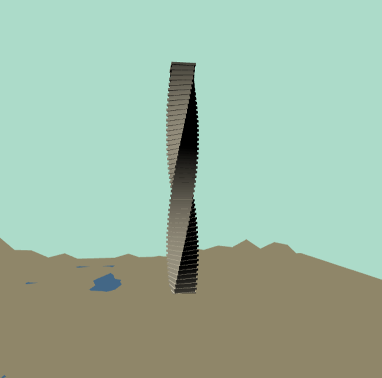

# Project 4: Shape Grammar

#### Grammar design:  
turtle.js is where all the magic happens.
- Everything starts with a giant cube. The cube divides and takes different paths to generate different buildings.
  - The most probable case is the cube getting divided into more cubes. Also, This is the only thing that happens when the cube is too big to create other geometries.
  - When a cube divides, 9 or less new cubes are formed, mostly taller than the original cube (unless it is too far away from the area with high population density).
  - Sometimes, if the dividing cube is small enough and closer to the downtown, it turns into a cylinder, and cylinders have their own different life story.
  - Sometimes, offsprings are not created upon division, or only a few of them are created to avoid a uniform grid pattern. This also gives rise to empty blocks. When such empty blocks are created near the downtown, a fancy spiral building with is created. If the empty blocks are far away, a monument may get created with a little probability. The monument has scale issues that need to be fixed.
- A cylinder never gets divided. Whenever a cylinder is in the list of current nodes, it gets expanded into more cylinders at each iteration and becomes a skyscraper.
- The monument starts from being a pyramid, and becomes something like a usual monument. At every iteration, pillars are added, steps are reduced, and the top part is enlarged.
- There is a limit to the number of times anything can be divided (to avoid needle buildings).
- Buildings are rotated a bit to avoid too much uniformity. Even after scaling them while rotating them, they sometimes intersect one another.
- The height of the buildings drop off with distance from the point with high population density. The point of highest density is chosen randomly (at some distance around the center), so results will vary at every execution. 

#### Issues:
- There is a texture tiling issue. Even after creating a copy of the material, changing the tiling parameters, changes them on all the cubes.
- The monument has scale issues.
- The intersection tests of geometry with the ground plane and with water bodies is buggy.
- I sort of invented my own noise algorithm because Perlin noise was too much work. It is bad.

#### Screen Shots:
##### City :
The dropoff due to population density can be seen.

##### Downtown :
The cylindrical towers can be seen here.

##### Spiral Tower:

##### Monument:

#### Demo:
https://rms13.github.io/Project4-Shape-Grammar/
